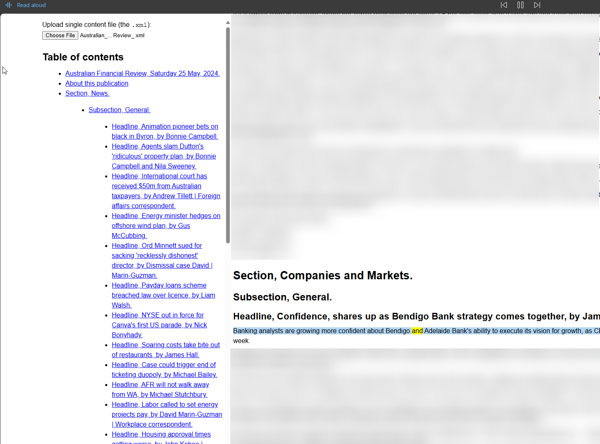

# What
## `simple.html`
A dead-simple way to render DAISY ebooks (content and TOC) for use with Microsoft Edge's 'Read Aloud'.

## Aspirational Goal
A full-featured in-browser DAISY reader.

# Background / Why
The [DAISY Consortium](https://daisy.org) maintains a standard for accessible ebooks and audiobooks implementing structured navigation and synchronization (using W3C's SMIL) on top of ordinary text and audio files. 

DAISY books are usually read with specialized DAISY readers to take advantage of the verbose navigation features, but, because DAISY ebooks are just XML files, it is trivially easy to render them in a web browser if you don't care about navigation but do care about using a modern text-to-speech voice. Which is, incidentally, how I ended up with `simple.html`. Vision Australia distributes Australian newspapers in DAISY ebook format, and I wanted to read one. While I would like to, eventually, write a full-featured reader for DAISY books, doing so was overkill for the task at hand, especially since the Read Aloud interface in Microsoft Edge is surprisingly good out of the box. 

Using Microsoft Edge, you can hook into Azure Speech's library of human-like voices for free. These sound much better than offline options like Microsoft David or the Nuance voices that come with my SensePlayer. 

Ultimately, though, I could add:

* Optional on-the-fly decompression - some DAISY books are zipped;
* My own tts controls (play/pause/speed/voice selection) instead of relying on the ones provided by Edge;
* Navigation - DAISY format contemplates navigating by heading, paragraph, spell, et cetera. The Edge interface only skips paragraphs.
* Saving bookmarks - so that you can resume where you left off.
* Hotkeys

# License Info
I am bundling `dtbook.2005.basic.css`, which is permitted by that file's license, to sidestep UI development at this stage. 

My own code is so simple at this stage that it barely deserves a license, therefore it is released under MIT.
